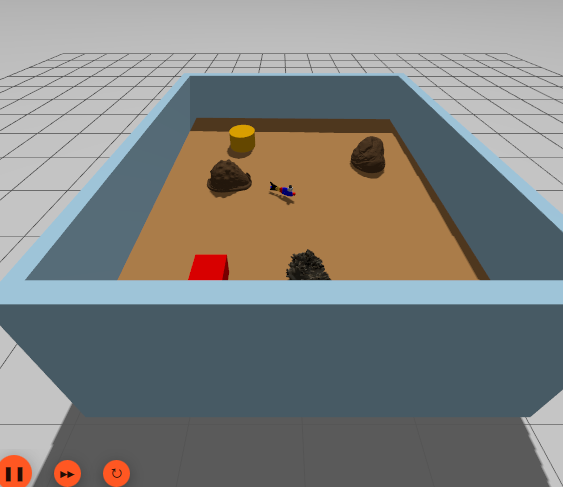
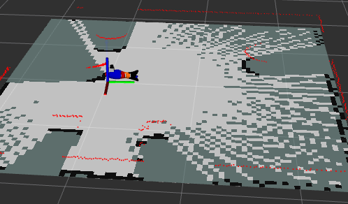
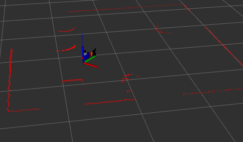
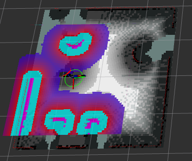

# Fish Robot ROS2 Navigation System

A comprehensive ROS2 (Jazzy) navigation stack for a biomimetic fish robot featuring SLAM, localization, and autonomous navigation using Gazebo Harmonic simulation, SLAM Toolbox, and Nav2.

## Overview

This repository contains a complete navigation solution for a fish robot that combines:

- **Biomimetic Motion**: Fish-like undulating motion control
- **SLAM Mapping**: Real-time map building using SLAM Toolbox
- **Localization**: Pose estimation in known environments
- **Autonomous Navigation**: Path planning and obstacle avoidance with Nav2
- **Simulation**: Full Gazebo Harmonic integration

The system is designed for ROS2 Jazzy and uses modern navigation tools to enable autonomous operation of a unique biomimetic robot platform.

## Repository Structure

```
Fish-Robot-ROS2/
├── assets/                    # Result images and screenshots
│   ├── spawn_robot_gazeebo.png
│   ├── mapping.png
│   ├── localization.png
│   └── navigation.png
├── src/                       # ROS2 packages
│   ├── fishy_fish_navigation/      # Main navigation package
│   ├── fishy_fish_navigation_py/  # Python utility package
│   └── README.md                   # Detailed documentation
└── README.md                  # This file
```

## Key Features

- 🐟 **Biomimetic Motion**: Sinusoidal tail undulation for natural fish-like movement
- 🗺️ **SLAM Mapping**: Real-time map building with loop closure
- 📍 **Localization**: Accurate pose estimation using pre-built maps
- 🧭 **Autonomous Navigation**: Nav2-based path planning and execution
- 🎮 **Gazebo Simulation**: Full physics simulation with sensors (LiDAR, IMU, Camera)
- 🔧 **Modular Design**: Separate packages for core functionality and utilities

## Quick Start

### Prerequisites

- ROS2 Jazzy
- Gazebo Harmonic
- Required ROS2 packages:
  - `nav2_bringup`
  - `slam_toolbox`
  - `robot_localization`
  - `ros_gz_sim`
  - `ros_gz_bridge`

### Building

```bash
cd Fish-Robot-ROS2
colcon build --symlink-install
source install/setup.bash
```

### Running

**1. Spawn Robot in Gazebo:**
```bash
ros2 launch fishy_fish_navigation spawn_robot.launch.py
```

**2. Start Mapping:**
```bash
ros2 launch fishy_fish_navigation mapping.launch.py
```

**3. Start Navigation:**
```bash
ros2 launch fishy_fish_navigation navigation_with_slam.launch.py
```

For detailed documentation, see [src/README.md](src/README.md).

## Visual Results

### Robot Spawned in Gazebo



The fish robot model spawned in the Gazebo simulation environment with all sensors active (LiDAR, IMU, Camera).

### SLAM Mapping



Real-time SLAM mapping in progress. The robot builds a map of the environment using LiDAR scans while exploring the world.

### Localization



Robot localizing itself in a pre-built map. The pose estimate is shown with uncertainty visualization, allowing the robot to know its position in the known environment.

### Autonomous Navigation



Autonomous navigation in action. Nav2 plans paths to goals while avoiding obstacles, using both global and local costmaps for safe navigation.

## Documentation

For comprehensive documentation including:
- Detailed node descriptions
- Launch file explanations
- Configuration guides
- Troubleshooting tips
- Complete workflow diagrams

Please refer to [src/README.md](src/README.md).

## Packages

### `fishy_fish_navigation`
Main navigation package containing launch files, configurations, robot models, and core nodes.

### `fishy_fish_navigation_py`
Python utility package providing command-line tools for:
- Map loading
- Initial pose setting
- Waypoint navigation

## License

Apache License 2.0

## Maintainer

Asim Khan (masimwork43@gmail.com)

## Acknowledgments

Built with:
- ROS2 Jazzy
- Gazebo Harmonic
- SLAM Toolbox
- Nav2 Navigation Stack
- Robot Localization

